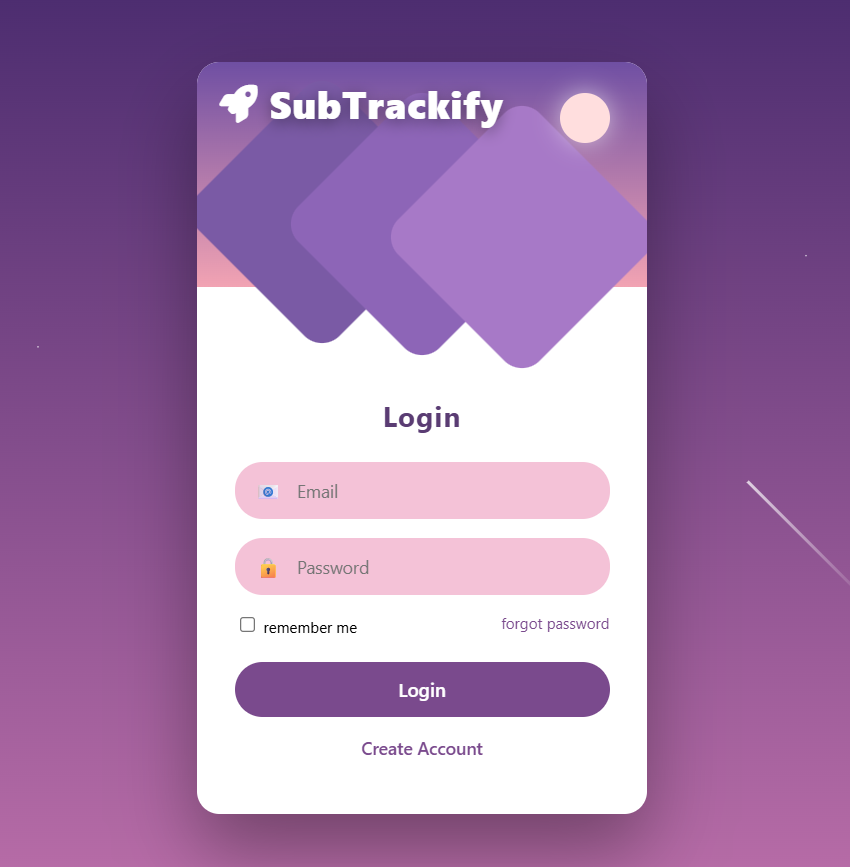
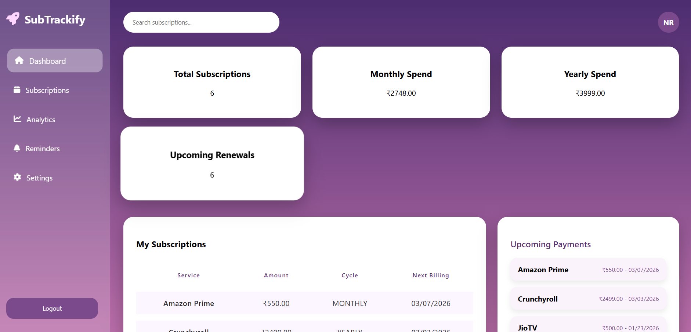
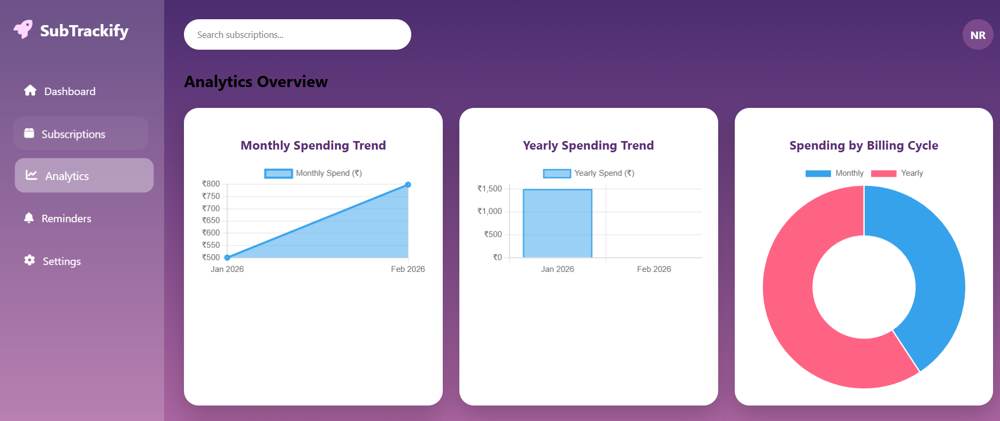

# 🚀 SubTrackify – Subscription Management & Analytics Platform

SubTrackify is a full-stack web application that helps users manage, track, and analyze their subscriptions in one place.
It provides real-time spending insights, reminders for upcoming payments, CSV import support, and a modern dashboard UI.

---

## ✨ Features

✅ User Login & Registration
✅ Add, View, Edit, and Archive Subscriptions
✅ Monthly & Yearly Spending Analytics
✅ Interactive Charts (Line, Bar, Doughnut)
✅ Smart Insights (Highest spend, totals, counts)
✅ Reminder System for Upcoming Payments
✅ CSV Import for Bulk Subscription Upload
✅ Currency & Date Format Settings
✅ Responsive Modern UI
✅ Backend API with Spring Boot
✅ PostgreSQL Database

---

## 🖥️ Tech Stack

**Frontend**

* HTML
* CSS
* JavaScript
* Chart.js

**Backend**

* Java
* Spring Boot
* REST APIs

**Database**

* PostgreSQL (Supabase)

**Tools**

* IntelliJ IDEA
* Git & GitHub
* Microsoft Azure (Hosting)

---

## 📊 Screenshots






---

## ⚙️ How to Run Locally

### Backend

1. Open project in IntelliJ.
2. Configure PostgreSQL connection in `application.properties`.
3. Run the Spring Boot application.

### Frontend

1. Open browser:

```
http://localhost:8080/login.html
```

---

## 📁 CSV Import Format

Your CSV file must follow this format:

| Service | Amount | Cycle   | NextBilling |
| ------- | ------ | ------- | ----------- |
| Netflix | 499    | MONTHLY | 2026-02-15  |
| Prime   | 1499   | YEARLY  | 2026-06-10  |

✔ Date format must be: **YYYY-MM-DD**
✔ Cycle must be: **MONTHLY** or **YEARLY**

---

## 🚀 Future Enhancements

* Email Notifications
* OTP Authentication
* Cloud Backup
* Mobile App Version
* AI Spending Predictions

---

## 👨‍💻 Author

**Neeraj Rajeev**
BTech Computer Science – VIT Vellore
Aspiring Software Engineer

---

⭐ If you like this project, give it a star on GitHub!


